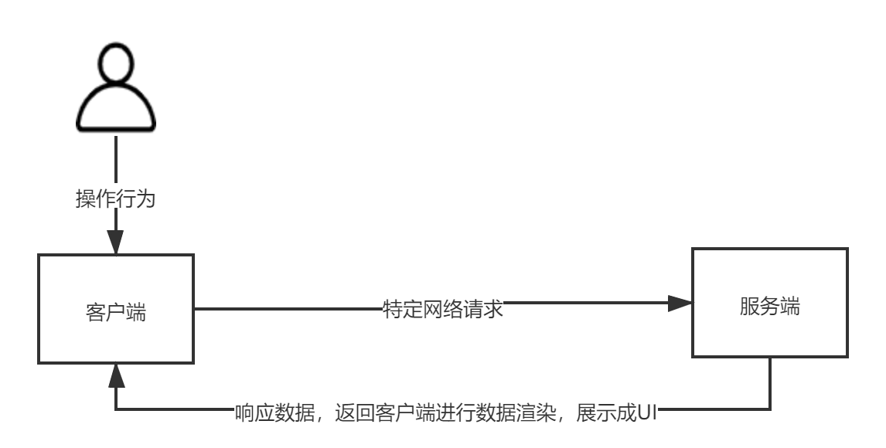
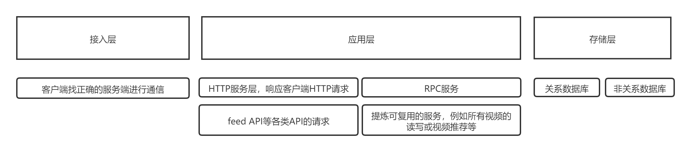
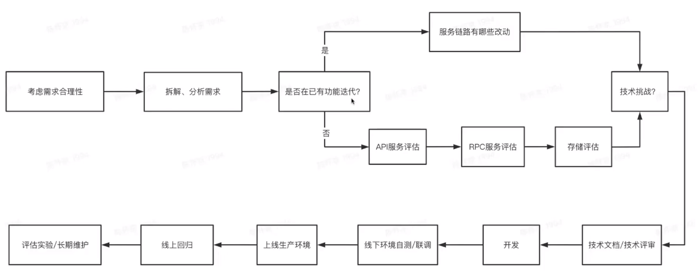

# 如何做好和服务端的交流

> 上周跟一个研发对一个需求聊了很久，对这个项目的底层有些疑问，后来发现，这个问题是个遗留性的问题，还不如我们在学校开发的项目的底层逻辑呢。。。一片混乱，把我搞晕了，来回顾下，一文battle服务端

## 交互过程

总结：客户端首先必须得对用户有感知，服务端才能跟他进行交互。这就联想到多年前一个产品提了一个需求-手机屏保的背景根据手机壳的颜色进行自动更换。这显然用户的操作行为无法感知，除非有个传感器能把这个手机壳传给客户端。

## 技术与服务端细分

### 技术细分

1. 运维
2. 开发：客户端（Andriod、iOS、Web）、服务端
3. 测试

### 服务端细分

1. 基础架构团队

服务于全公司的的基础架构，包括计算资源、存储资源、网路接入、运维

    2. 业务服务端

IES架构、推荐、策略数值、各类中台

> 有个问题来了，什么是中台？

阿里提出小前台，大中台，阿里里面的各种app，饿了么，盒马生鲜等，大中台就是app之间的业务共性，实现业务共用。

业务中台：例如账户中台用于用户登录，地理位置中台负责获取地理经纬度等等

技术中台：防止造轮子

## 服务端工作流程

